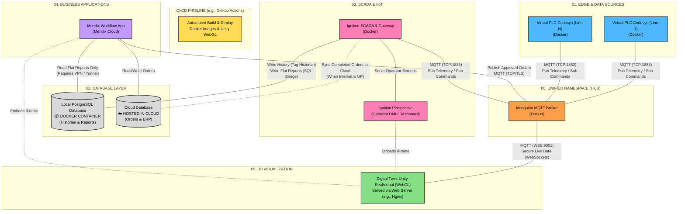

# Smart Factory 4.0 - Architecture Diagram

Below is the comprehensive architecture diagram. Mendix has been restored as the central Business Application (IT layer), while Ignition acts as the factory-floor SCADA (OT layer). The mobile HMI for Ignition has been removed.

### Why Mendix is Crucial (The IT/OT Split):
1. **Sales & Workflow Management:** Ignition is great for machine control, but bad for multi-step human workflows (like credit checks, manager approvals). Mendix provides the perfect "Customer/Manager Portal" to process these orders before pushing them to the factory floor.
2. **Maintenance Ticketing (CMMS):** If a machine errors out, Ignition can publish an alarm to MQTT. Mendix picks it up and generates a maintenance ticket, assigns a technician, and tracks the repair workflow.
3. **IT vs OT:** Mendix represents the IT (Information Technology) business layer. Ignition represents the OT (Operational Technology) factory layer. Having both demonstrates an enterprise-grade understanding of Industry 4.0.
