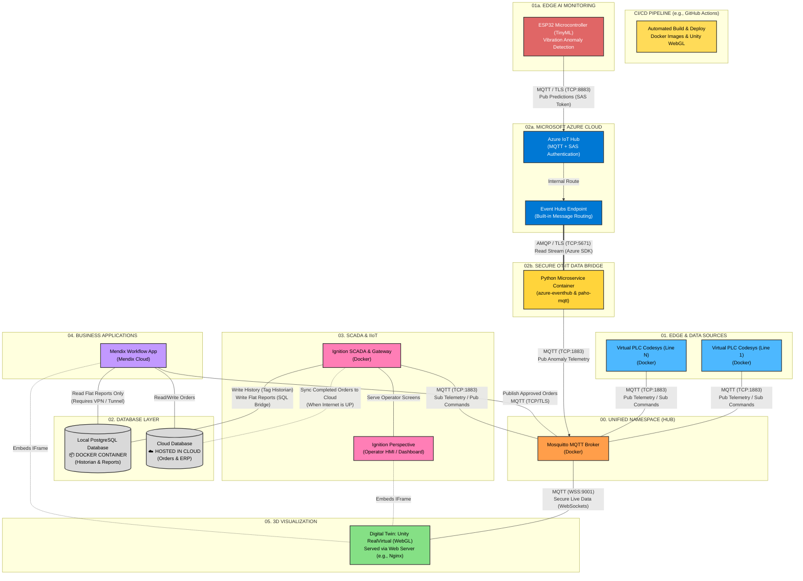

# Smart Factory 4.0 - Architecture Diagram

Below is the comprehensive architecture diagram. Mendix acts as the business application (IT layer), Ignition acts as the local SCADA (OT layer), and we have integrated a new secure **Edge-Cloud OT-IT Bridge** featuring a physical ESP32 (running TinyML) and Microsoft Azure.

---

## System Architecture Diagram

---

## Key Technical Highlights & Architecture Advantages

### 1. Hybrid Edge-Cloud TinyML Processing
Instead of streaming high-frequency, raw accelerometer vibration data to the cloud (which degrades bandwidth and increases latency/costs), we process the data at the **Edge**. 
- The physical **ESP32 microcontroller** executes a compiled **TinyML classification model** locally.
- Only the processed inference results (predictions, anomaly status, and confidence levels) are packaged as lightweight JSON and sent to Azure.

### 2. High-Grade Security & Isolation of the OT Layer (Zero Trust)
Industrial safety depends on strict network segmentation. Exposing a SCADA gateway (`ignition-gateway`) directly to the internet is a severe vulnerability. 
- **The OT Layer is fully isolated:** The Ignition SCADA and local PLCs operate entirely within the internal, secure Docker bridge network. Ignition has no direct internet access and only communicates with the local Mosquitto broker.
- **Python Security Shield:** A dedicated, custom **Python microservice** acts as the secure OT-IT gateway. It alone handles the external AMQP/TLS handshake and SAS Token credentials with Microsoft Azure. It consumes data from the cloud and forwards it internally, preventing any external entity from connecting directly to the factory network or the SCADA database.

### 3. Containerized Data Transformation Pipeline
The Python bridge is completely containerized within `docker-compose.yml`. This microservice-oriented design offers:
- **Isolation & Portability:** Running the Python consumer script inside a Docker container ensures dependencies (like `azure-eventhub` and `paho-mqtt`) are completely self-contained.
- **Resiliency & Auto-Healing:** Configured with `restart: unless-stopped` in Docker Compose, the bridge automatically recovers and reconnects if the network or Azure connection drops.

### 4. Enterprise-Grade Cloud Ingestion (Microsoft Azure)
The project showcases integration with industry-standard cloud frameworks:
- **Azure IoT Hub:** Serves as the secure ingestion gateway for physical embedded hardware.
- **Built-in Event Routing:** Azure Routes direct payloads to an Event Hubs endpoint, proving knowledge of scalable cloud architecture.

---

### Why Mendix is Crucial (The IT/OT Split):
1. **Sales & Workflow Management:** Ignition is great for machine control, but bad for multi-step human workflows (like credit checks, manager approvals). Mendix provides the perfect "Customer/Manager Portal" to process these orders before pushing them to the factory floor.
2. **Maintenance Ticketing (CMMS):** If a machine errors out, Ignition can publish an alarm to MQTT. Mendix picks it up and generates a maintenance ticket, assigns a technician, and tracks the repair workflow.
3. **IT vs OT:** Mendix represents the IT (Information Technology) business layer. Ignition represents the OT (Operational Technology) factory layer. Having both demonstrates an enterprise-grade understanding of Industry 4.0.
