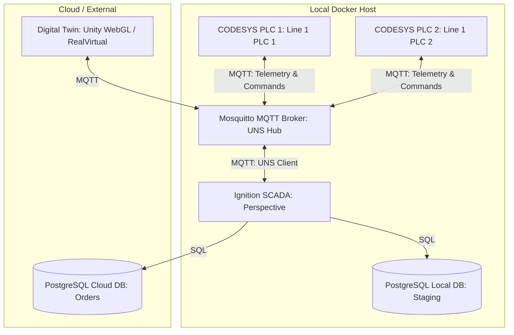

# IIoT Smart Factory Portfolio Project Plan

This document outlines the architecture, scope, and implementation plan for the Unified Name Space (UNS) based Smart Factory project. 

---

## Project Goal
To build a scalable, containerized Industrial IoT (IIoT) and SCADA infrastructure demonstrating bidirectional communication, Unified Name Space (UNS) architecture, and a Digital Twin interface. The entire stack runs in Docker for easy deployment and scaling.

---

## System Architecture Diagram

---

## Component Specifications & Current Progress

### 1. Virtual PLCs (CODESYS Control)
- **Scope**: Run multiple CODESYS Control instances in Docker simulating production lines.
- **Telemetry**: Each PLC simulates state (Running/Idle), part counters, cycle times, and safety status (ESTOP).
- **Communication**: Telemetry is published to MQTT under the UNS format. Control commands (`START` / `STOP`) are subscribed to and processed in real-time.
- **Current Status [COMPLETED]**:
  - `novatech-warsaw-assembly-line1-plc1` and `plc2` containers are configured.
  - Dynamic simulation code written in Structured Text (ST) including a buffer-cleansing logic using the `FIND` function for stable command parsing.
  - Auto-start configured: skompilowane programy (`PlcLogic`) zmapowano na dysk gospodarza w `./Codesys/plc{N}_logic/`, sterowniki uruchamiają program natychmiast po starcie kontenera.

### 2. UNS MQTT Broker (Mosquitto)
- **Scope**: Serves as the central communication hub (Unified Name Space). Every node (PLCs, SCADA, Digital Twin) communicates exclusively via this broker.
- **Topic Structure**: Follows the ISA-95 standard:
  - Telemetry: `[Enterprise]/[Site]/[Area]/Line[NrLine]/PLC[NrPLC]/Status/...`
  - Commands: `[Enterprise]/[Site]/[Area]/Line[NrLine]/PLC[NrPLC]/Cmd`
- **Current Status [COMPLETED]**:
  - Container `mosquitto-uns` running on port `1883` (MQTT) and `9001` (WebSockets for Unity WebGL).

### 3. SCADA & HMI (Ignition Perspective)
- **Scope**: Industrial SCADA dashboard to monitor throughput, safety status, and control the PLCs.
- **Features**:
  - **Dynamic Faceplate**: Parameterized view (`AssemblyPLC_Faceplate`) bound to indirect tags that automatically adapts based on `Enterprise`, `Site`, `Area`, `NrLine`, and `NrPLC` parameters.
  - **Start/Stop controls**: Event scripts trigger MQTT Transmission publishes to target PLC `Cmd` topics.
  - **Dashboard**: A main grid view (`DashBoard`) embedding multiple instances of the HMI faceplate side-by-side.
- **Current Status [COMPLETED]**:
  - Perspective project created. Dashboard configured with two embedded faceplates monitoring and controlling PLC 1 and PLC 2 independently.
  - Gateway configuration file `config.idb` and project folder `projects` mapped locally under `./ignition/` to prevent data loss.
  - MQTT Transmission RPC client enabled.

### 4. Database Storage (Postgres)
- **Scope**: Local DB for history logging (Staging) and a cloud-based DB for managing orders.
- **Current Status [IN PROGRESS]**:
  - `postgres-local` (port 5432) and `postgres-cloud` (port 5433) containers are running. History logging to be configured during SCADA scaling.

### 5. Digital Twin (Unity WebGL / RealVirtual)
- **Scope**: A simple 3D simulation of the assembly cell compiled to WebGL. It connects to the Mosquitto Websocket port (`9001`) and moves in sync with the MQTT status payloads.
- **Current Status [PLANNED]**:
  - Unity project to be created and linked to `NovaTech/#` topics.

### 6. Mendix App (Low-Code Portal)
- **Scope**: Enterprise level low-code dashboard to check order status and interact with the databases, utilizing MQTT for UNS compatibility.
- **Current Status [PLANNED]**:
  - To be evaluated based on timeline.

---

## Version Control & Infrastructure
- **Status [COMPLETED]**:
  - Git repository initialized.
  - Plik `.gitignore` created to prevent committing sensitive passwords (`.env`), system-specific files, and CODESYS cache files (`*.precompilecache`, `*.opt`).
  - SCADA files, PLC logic, broker configuration, and docker-compose settings are now fully versioned.
